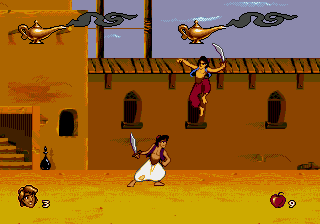
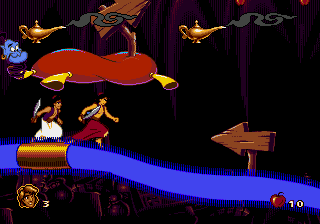
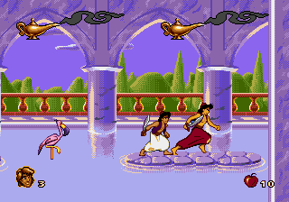

# Aladdin Co-op

Explore Agrabah with a friend! Play Aladdin's adventure together, from the opening level to the final showdown.

## Screenshots

### Agrabah

### Inside the Lamp

### Sultan's Palace

## Play together

- Two players, each with their own movement, sword, apples, and health bar.
- Play through the story, boss fights, and Abu bonus rooms together.
- P1 wears purple and white; P2 wears blue and red.
- Share lives and stay together as the camera follows both players.
- Rejoin your partner when you get separated, with Genie sparkles and sound.
- Ride your own magic carpet during the escape!

In the title-screen **Options**, choose what happens when a player dies:

- **PARTNER:** the fallen player returns beside their surviving partner.
- **CHECKPOINT:** both players return to the checkpoint.

Either choice costs one shared life. If both players fall, you return to the checkpoint.

## Controls

| Action | Player one | Player two | Xbox-style controller |
| --- | --- | --- | --- |
| Move / climb / crouch | WASD | Arrow keys | D-pad / left stick |
| Sword | F | J | X |
| Apple | G | K | B |
| Jump | Space | L | A |
| Rejoin partner (Genesis X) | X | O | Y |
| Pause | Enter | Enter | Start |

These are the default standalone controls; in BizHawk, configure both players under **Config > Controllers**.

## Getting started

Play on Windows using the standalone game or BizHawk. You'll need your own USA version of Aladdin; the game ROM isn't included.

See [setup instructions](bizhawk/README.md) to get started. To build the game yourself, use the [developer guide](DEVELOPMENT.md).

## Found a bug?

The co-op campaign is still being playtested. [Report an issue](https://github.com/Linn1024/aladdin-coop/issues) with the level, what happened, and a screenshot if possible. Keep a save near the problem so it can be reproduced.
